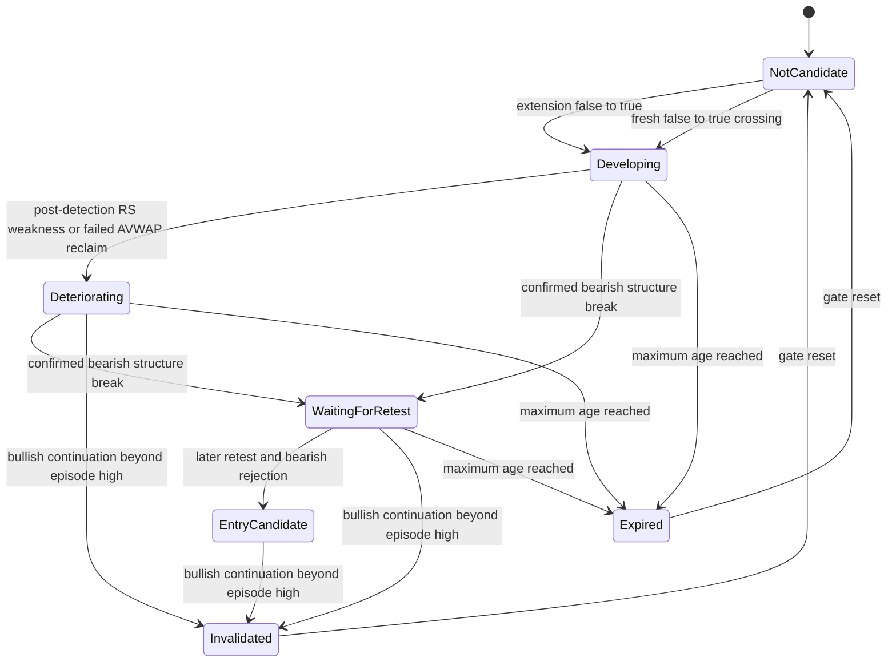

# Impulse Fade v1 Lifecycle

Impulse Fade v1 is an auditable market-state description. It does not create orders, size
positions, or claim that a setup is profitable.

## Candidate Gate

A candidate begins on a false-to-true edge of the fixed extension gate. The current v1 gate is
true when at least one of these conditions is true:

- elapsed 24-hour return is at least 8%;
- rolling 24-hour return percentile is at least 95;
- rolling 24-hour return Z-score is at least 2;
- close displacement from EMA 20 is at least 2 ATR 14 on the execution timeframe.

The values are intentionally unchanged by this audit. `CandidateMetrics` observations are
authoritative when supplied to the timeline evaluator. Otherwise the evaluator derives the same
classes of metrics from the available execution-timeframe candles.

An episode is scoped by:

```text
setup family + symbol + source + venue + execution timeframe + detectedAt
```

Only one episode can be selected for that scope at a time. Its deterministic ID and detection
snapshot do not change. A new ID requires a terminal prior episode, an observed false gate, and a
new false-to-true crossing.

## Time Semantics

OHLCV `ts` and `bucket` values are candle **open times** in Unix seconds. A candle is confirmed and
usable at:

```text
knownAt = openTime + timeframe duration
```

Therefore a 1-hour candle opened at 09:00 cannot affect a 15-minute evaluation at 09:15, 09:30,
or 09:45. Its final values become available at 10:00. A pivot has the pivot candle's open time as
`eventTime`, but its `knownAt` is the close of the required confirmation candle. No provisional
partial-candle evidence is accepted by Impulse Fade v1.

`eventTime` answers when the market event belongs. `knownAt` answers when the system could first
know it. Every event must satisfy `knownAt <= asOf`. Candidate-advancing evidence additionally
requires `knownAt > candidate.detectedAt` and `eventTime >= candidate.detectedAt`. The strict
`knownAt` inequality prevents the candidate-detection candle from also advancing the episode.

Pre-existing S/R zones are the deliberate exception: a zone known by `asOf` may provide static
context even when it predates the candidate. It is confluence, not a new deterioration event.

## State Machine



`Invalidated` and `Expired` are terminal for an episode. `EntryCandidate` is not age-expired in v1;
it remains available for discretionary review until continuation invalidates it. States never
regress within an episode.

## Break And Retest Ordering

A qualifying break is a post-detection, confirmed bearish `StructureBreak` or `StructureShift` on
the execution timeframe. It stores the active break level and produces `WaitingForRetest`.

A retest/rejection must use a later completed candle:

```text
retest.eventTime >= break.knownAt
retest.knownAt > break.knownAt
```

That candle must touch the configured level tolerance, close below the level, and close no higher
than it opened. A break and apparent retest in the same candle is rejected because intrabar order
is unknown. Retest and rejection may share one later candle because both are confirmed together at
that candle's close.

An AVWAP loss is weak context only. A post-detection failed reclaim can move `Developing` to
`Deteriorating`, but neither can create `WaitingForRetest` or `EntryCandidate` without the required
bearish structure break and later retest.

## Deterministic Evaluation

Use the pure package API for replay, tests, and future scanner work:

```ts
const trace = evaluateImpulseFadeTimeline({
  symbol: "FILUSDT",
  source: "external",
  venue: "bybit",
  executionTimeframe: "1h",
  candlesByTimeframe,
  candidateMetrics,
  structureEvents,
  supportResistanceZones,
  avwapEvents,
  relativeStrengthEvents,
  config,
  from,
  to,
});
```

The evaluator has no Vue or rendering state. Confirmed execution-timeframe structure events are
retained append-only during evaluation, so a later structure recalculation cannot erase a terminal
event. Stable event IDs prevent duplicate evidence and transitions. `evaluateImpulseFadeSnapshot`
uses the same rules for the chart's current completed-candle badge.

For development inspection:

```sh
pnpm audit:impulse-fade fixtures/impulse-fade-audit.example.json
pnpm audit:impulse-fade fixtures/impulse-fade-audit.example.json --out trace.json
```

The JSON trace includes the cutoff, candidate ID, state, newly observed transition/evidence,
pending condition, confluence, break/retest levels, terminal reason, and data-quality notes.

## CandidateMetrics API

`GET /api/candidate-metrics/{symbol}` accepts optional Unix-seconds `asOf` (or `as_of`). Local and
external reads are bounded by that cutoff. Every calculation uses only candles whose close time is
at or before the cutoff, including the elapsed return reference, rolling return sample, EMA, and
ATR.

The response includes `requestedAsOf`, `effectiveAsOf`, `sampleCount`, `historyCoverage`, and
structured `insufficientDataReasons`. Missing history produces `null` metrics rather than zeroes.
External pagination remains bounded to 24 pages and 5,000 candles.

## Acceptance Matrix

| Requirement | Location | Status | Evidence / limitation |
| --- | --- | --- | --- |
| CandidateMetrics `asOf` | dashboard `backend/crates/api/src/ohlcv.rs` | Complete | Rust cutoff, closure, response, missing-data, and truncation tests; live provider behavior remains an integration risk. |
| Candidate-relative evidence | `src/indicators.ts` | Complete | Stale RS fixture plus AVWAP, structure, and re-arm tests. |
| `eventTime` / `knownAt` | `src/indicators.ts` | Complete | Candle-close and pivot-confirmation fixtures. |
| Monotonic transitions and stable IDs | `src/indicators.ts` | Complete | Invariant suite and preserved SOL regression fixture. |
| Expiry | `src/indicators.ts` | Complete | Terminal expiry and continuously-true gate fixture. |
| Invalidation | `src/indicators.ts` | Complete | Synthetic continuation plus real SOL terminal fixture. |
| False-to-true re-arm | `src/indicators.ts` | Complete | Terminal/reset/fresh-crossing and gate-flapping fixtures. |
| Break, retest, rejection chronology | `src/indicators.ts` | Complete | Four-state ordered transition fixture. |
| Same-candle ambiguity | `src/indicators.ts` | Complete | Break candle cannot also satisfy the later retest. No separate ambiguity label is emitted. |
| MTF closure and detection snapshot | `src/indicators.ts` | Complete | Forming 1-hour fixture and immutable initial-context fixture. |
| Truncated-data equivalence | package and dashboard backend tests | Complete | Synthetic lifecycle, real SOL lifecycle, and CandidateMetrics full-versus-truncated equality. |
| Determinism and deduplication | `src/setupLifecycle.test.ts` | Complete | Deep/byte equality and unique evidence/transition IDs. |
| Audit output | `scripts/audit-impulse-fade.mjs` | Complete | Built-package CLI plus example input. |
| Documentation and diagram | this document | Complete | Gate, time, lifecycle, ordering, terminal, re-arm, and limitations documented. |
| ARB/FIL/SOL/continuation audits | below | Complete | Bounded Bybit reads; exact prior chart settings and AVWAP anchors were unavailable. |

## Manual Audit

The audit used bounded Bybit linear-perpetual 1-hour data. ARB, FIL, SOL, and matching BTC reads
were limited to 500 bars; MARSCOIN was limited to 300 requested bars and returned 56. Times are
UTC. These are mechanical lifecycle checks, not strategy validation.

### ARBUSDT

- Candidate: detected 2026-08-21 08:00 (`eventTime` 07:00).
- 2026-08-23 04:00: confirmed bearish Shift, `Developing -> WaitingForRetest`.
- 2026-08-23 05:00: next candle retest/rejection, `WaitingForRetest -> EntryCandidate`.
- 2026-09-03 03:00: bullish continuation above episode high 0.12785, `EntryCandidate -> Invalidated`.
- No stale RS event was available to explain the old screenshot's `Deteriorating` badge. That exact
  display is not reproducible because its cutoff/settings were not preserved; the corrected run is
  mechanically consistent and does not invent an RS transition.

### FILUSDT

- An older candidate detected 2026-08-21 00:00 expired on 2026-08-24 00:00.
- Fresh gate crossing detected a new candidate on 2026-09-01 11:00.
- 2026-09-03 08:00: post-detection `RS BREAK` produced `Developing -> Deteriorating`.
- 2026-09-03 09:00: bearish Shift through about 0.7859 produced `WaitingForRetest`.
- 2026-09-03 10:00: the following candle's retest/rejection produced `EntryCandidate`.
- Fourteen older RS events were excluded from the new episode. No AVWAP events were supplied
  because the screenshot's manual anchor was not preserved, so exact AVWAP loss/reclaim behavior
  remains unaudited rather than inferred.

### SOLUSDT

- Candidate detected 2026-08-20 17:00; bearish Shift at 2026-08-23 05:00; later retest/rejection at
  06:00 produced `EntryCandidate`.
- Bullish continuation at 2026-08-27 09:00 invalidated the episode above high 103.21.
- The prior implementation regressed that same ID back to `EntryCandidate` at 13:00. The preserved
  fixture now keeps it terminal, then creates a new deterministic ID after the gate reset at 14:00.
- The new episode reached `WaitingForRetest` on 2026-08-28 12:00 and `EntryCandidate` on the next
  completed candle at 13:00. Eight RS events from the old episode were not reused by the new one.

### Continuation Control

- MARSCOINUSDT detected a candidate on 2026-09-03 04:00 after a large continuation move.
- Across the bounded trace it remained `Developing`: no bearish break, retest, or entry was
  manufactured.

No unresolved same-candle break/retest was accepted in these runs. The local ClickHouse volume had
only fragmented June 29 and August 25 coverage, so public historical reads were used for the manual
checks.

## Known Limitations

- Audit reproducibility still depends on preserving every primitive event. The evaluator retains
  confirmed derived structure events within a run, but a caller that supplies an already-truncated
  RS, AVWAP, or structure event list cannot recover omitted history.
- The external exchange cutoff is unit-tested at the request boundary but not covered by a live
  provider integration test.
- Historical ARB/FIL screenshots did not preserve their exact cutoff, chart settings, or AVWAP
  anchor. Their visual badge cannot be reproduced byte-for-byte.
- Retest and rejection are one completed-candle event in v1; intrabar sequencing within that later
  candle is not reconstructed.
- EntryCandidate remains a discretionary state. Replay P/L, execution costs, sizing, and order
  simulation are intentionally out of scope.
