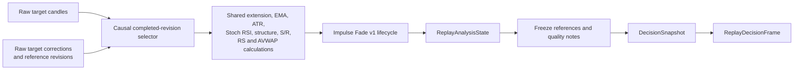
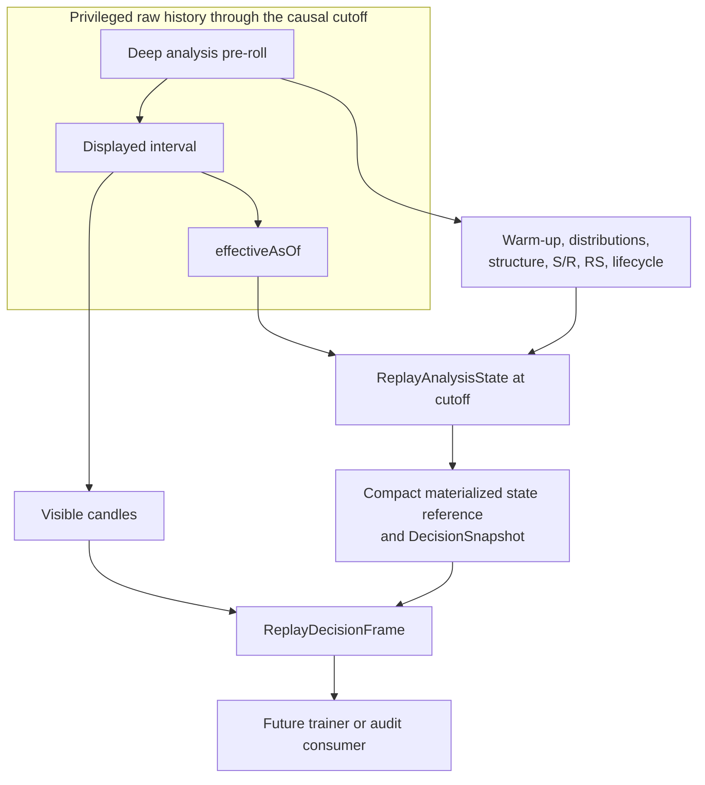
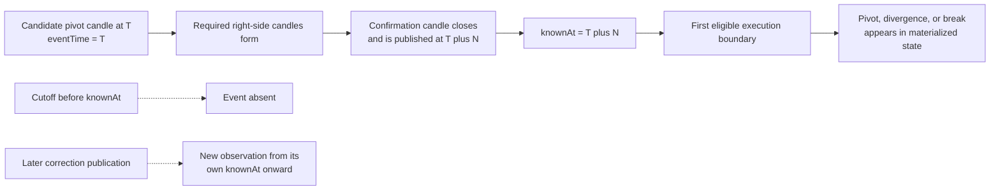

# Replay Analysis Materialization

## Status and scope

Replay Phase 2B adds a framework-independent historical analysis materializer.
Given revision-aware target and reference OHLCV data plus an `asOf` cutoff, it
reconstructs the strategy and chart state that was causally available at that
historical moment. The result can feed a headless audit, a replay decision
session, a future trainer, or a live/replay parity test without depending on a
Vue component or renderer.

The materialized result includes:

- candidate metrics and fixed-window extension context;
- EMA, ATR, and Stoch RSI series;
- local and multi-timeframe structure, confirmed structure events, and active
  BOS, Shift, Range H, and Range L levels;
- local and projected S/R zones derived from the same confirmed swings;
- normalized RS versus BTC, its structure, and DIV, LEAD, and BREAK events;
- one or more explicitly anchored AVWAP series plus loss, reclaim, and failed
  reclaim events;
- the unchanged Impulse Fade v1 lifecycle and setup-state details;
- component coverage, freshness, source-observation identities, configuration
  hashes, and data-quality notes.

This phase does not add a visual replay UI, playback controls, automatic AVWAP
anchor selection, new indicators, threshold optimization, database persistence,
or live execution.

## Module boundary

The materialized path is exported from `@cryptodouche/gpu-chart-vue/core` and is
split across these framework-independent modules:

| Module | Responsibility |
| --- | --- |
| `src/replayAnalysis.ts` | Profiles, anchor specifications, causal selection, pure materialization, observations, coverage, and projections into decision inputs. |
| `src/replayAnalysisSession.ts` | Incremental analysis sessions, integrity-checked serialization/resume, bounded caching, correction invalidation, and provider interfaces. |
| `src/replayAnalysisJsonAdapter.ts` | Strict target/reference JSON fixture parsing and in-memory analysis-data adapters. |
| `src/replayMaterialized.ts` | `replay-engine.2` loading, timeline materialization, known-event generation, and integration with replay decision frames. |
| `src/data.ts` | Strict timeframe parsing and completed revision selection. |
| `src/indicators.ts` | Shared extension, indicator, structure, S/R, RS, AVWAP, and lifecycle calculations also used by the chart. |
| `src/strategy.ts` | Immutable `DecisionSnapshot` construction and frozen decision references. |

The Vue chart is a renderer and consumer. It is not a historical analysis
provider and must not introduce separate calculation semantics.

## Version and identity contract

Persist semantic identifiers and canonical hashes with every analysis artifact.
A package version alone is not sufficient to identify calculation behavior.

| Artifact | Identifier |
| --- | --- |
| Supplied-observation replay engine | `replay-engine.1` |
| Materialized replay engine | `replay-engine.2` |
| Analysis engine | `replay-analysis-engine.1` |
| Analysis profile schema | `replay-analysis-profile.1` |
| Legacy supplied analysis state | `replay-analysis-state.1` |
| Materialized analysis state | `replay-analysis-state.2` |
| Materialized component observation | `replay-analysis-observation.1` |
| Analysis frame identifier | `replay-analysis-frame.1` |
| Analysis data-bundle fingerprint schema | `replay-analysis-data-bundle.1` |
| Incremental analysis session | `replay-analysis-session.1` |
| Incremental analysis session event | `replay-analysis-session-event.1` |
| Portable target/reference JSON data | `replay-analysis-data.1` |
| Explicit AVWAP anchor | `avwap-anchor-spec.1` |
| RS formula | `relative-ratio.1` |
| Lifecycle | `impulse_fade_v1.lifecycle.1` |

The Phase 2B specification initially preferred `replay-analysis-state.1` for the
materialized result. That name was already the persisted `replay-engine.1`
supplied-observation schema. Reusing it would make two incompatible meanings
share one identifier and would silently reinterpret old sessions. Materialized
states therefore use `replay-analysis-state.2`; the v1 schema remains unchanged.

The integrated public frame remains `replay-decision-frame.1`. Under
`replay-engine.2` it carries a `materializedAnalysisStateRef` containing the
state ID, materialized schema, analysis-engine version, analysis-profile hash,
and causal data-bundle fingerprint. `replay-analysis-frame.1` identifies the
analysis-layer frame contract and does not replace the public decision-frame
schema in the current bridge.

A new materialized session binds at least:

- replay and analysis engine versions;
- analysis profile ID, version, and canonical configuration hash;
- target and reference market identities;
- selected raw target/reference observation IDs at the cutoff;
- lifecycle version/configuration hash;
- radar profile ID, version, and hash;
- strategy profile ID, version, and hash;
- explicit AVWAP anchor definitions;
- component calculation configuration hashes.

Any semantic calculation change requires a new engine/profile version or a new
canonical configuration hash.

## Replay engine compatibility

### `replay-engine.1`: supplied observations

The original engine reads sparse `ReplayAnalysisStateObservation` records from
`analysisStateHistory`. Between supplied observations it can carry the latest
known state into a later decision frame and records
`CARRIED_FORWARD_ANALYSIS_STATE` when appropriate. This behavior is retained so
existing sessions and generated fixtures remain reproducible.

The v1 compatibility boundary is strict:

- `REPLAY_ENGINE_VERSION` still means `replay-engine.1`;
- v1 cannot accept a materialized-analysis binding;
- its schemas and canonical serialization are not widened with defaulted v2
  fields;
- the four generated v1 replay/session files are protected by literal SHA-256
  golden tests.

### `replay-engine.2`: materialized analysis

The v2 loader reads raw target and reference records, chooses revisions
causally, and creates an analysis state at each execution-timeframe evaluation
point. Those states are projected into replay observations and known events so
scheduled and conditional waits use raw-derived state rather than a manually
supplied sparse sidecar.

Every v2 decision frame points to the exact materialized state used to construct
its `DecisionSnapshot`. The `CARRIED_FORWARD_ANALYSIS_STATE` warning is only
generated for `replay-engine.1`; it is not a substitute for v2 calculation.

The providers make the distinction explicit:

- `SuppliedObservationReplayAnalysisProvider` preserves v1 selection semantics;
- `MaterializedReplayAnalysisProvider` supports materialization, incremental
  advancement, updates, serialization, and resume for v2.

## Analysis profile

`ReplayAnalysisProfile` is JSON-serializable and owns analytical behavior. UI
visibility and the currently displayed chart timeframe are deliberately absent
from it. The profile binds:

- symbol/source and market-type policy;
- reference symbol/source policy;
- evaluated, execution, and context timeframes;
- extension, Stoch RSI, structure, S/R, RS, and AVWAP configuration;
- lifecycle configuration reference;
- completed-candle, missing-data, alignment, and correction policies;
- a canonical configuration hash.

`createExperimentalReplayAnalysisProfile()` creates the unoptimized research
profile for the current Impulse Fade workflow. With the default strategy
profile, the roles are:

| Role | Timeframe |
| --- | --- |
| Candidate metrics and setup structure | `1h` |
| Execution and trigger timing | `15m` |
| Context | `4h`, `1d` |
| Relative-strength reference | `BTCUSDT` on the target source unless another source is explicitly configured |

The analysis profile derives these roles from the strategy profile and validates
that its execution timeframe and lifecycle hash agree. Changing a chart panel
from 15m to 1h therefore cannot silently change historical analysis semantics.
This is a research configuration, not an optimized or validated trading model.

## Causal materialization pipeline



`materializeReplayAnalysis()` is pure with respect to its arguments. Identical
inputs and `asOf` produce deeply equal output and content-derived IDs. It:

1. Validates profile, strategy, radar episode, and lifecycle bindings.
2. Resolves `effectiveAsOf` from the latest completed execution-timeframe
   candle available by the requested cutoff.
3. Selects the latest known revision of each logical target and reference
   candle.
4. Converts selected records into the shared chart's `CandleRecord` input.
5. Runs shared calculations component by component.
6. Reconstructs the Impulse Fade lifecycle from those cutoff-safe primitives.
7. Emits immutable JSON-compatible records, provenance, coverage, freshness,
   quality notes, and a content-derived state ID.

Missing numerical values remain `null` or absent according to their existing
types. They are never changed to zero.

## Raw-candle cutoff and `effectiveAsOf`

All timestamps are UTC Unix seconds unless a later version states otherwise.
Every raw candle carries explicit `openTime`, `closeTime`, `knownAt`, logical
candle identity, observation identity, and optional correction provenance.

A record is eligible only when both conditions hold:

```text
closeTime <= requested cutoff
knownAt   <= requested cutoff
```

For each logical candle, the selector chooses the eligible revision with the
latest `knownAt`. Equal-precedence records with different canonical content are
rejected.

`requestedAsOf` records what the caller requested. `effectiveAsOf` is the most
recent eligible close of the configured execution timeframe. If a request falls
between evaluation boundaries, the materializer returns the last completed
state rather than manufacturing partial analysis. If no completed execution
candle exists, materialization fails with `NO_COMPLETED_EVALUATION_CANDLE`.

This rule applies independently to every timeframe. A 09:00-10:00 1h candle
cannot influence 09:15, 09:30, or 09:45 frames. A 4h or 1d candle is excluded
until its own close is complete and its selected revision is known.

## Current, insufficient, missing, and unavailable

An unchanged logical result is not stale. For example, 1h structure can remain
Bullish after a newly completed 1h candle while still being freshly evaluated.
Consumers determine currency from component freshness, not from whether the
label changed.

Each component publishes a `ReplayAnalysisFreshness` record with:

- `evaluatedAt`;
- latest input close and knowledge times;
- `status`;
- sample count;
- required and available coverage;
- exact source observation IDs;
- calculation configuration hash.

The statuses are:

| Status | Meaning |
| --- | --- |
| `available` | Evaluated at the current effective cutoff with sufficient eligible input. The logical value may be unchanged. |
| `insufficientHistory` | The input exists but required warm-up or historical coverage is unavailable. Quality notes use `INSUFFICIENT_ANALYSIS_HISTORY`. |
| `missingSynchronizedReferenceData` | Target data exists but an exact eligible reference bar is missing. This is currently used by RS. |
| `unavailable` | The component cannot be calculated, for example no completed candles or no explicit AVWAP anchor. Quality notes use `ANALYSIS_COMPONENT_UNAVAILABLE` where applicable. |

Component failure is isolated. Missing BTC data disables RS but does not erase
valid extension or price structure. Missing AVWAP does not become an AVWAP of
zero and does not suppress unrelated indicators. Lifecycle quality notes retain
which evidence was unavailable.

## Analysis pre-roll and display pre-roll

Analysis often needs more history than a chart should display. Percentile and
Z-score history, EMA/ATR warm-up, confirmed pivots, S/R clustering, RS structure,
and lifecycle reconstruction use analysis pre-roll. A decision frame exposes
only its configured display pre-roll.



`ReplayDataBundle.analysisStartByTimeframe` and
`displayStartByTimeframe` retain the two coverage boundaries. The materialized
state may contain derived series and exact source IDs, but the public
`ReplayDecisionFrame` does not serialize deep raw analysis candles. Its visible
candles are selected separately, filtered by the frame cutoff, and bounded by
display pre-roll.

## Shared indicator calculations and parity

Replay does not maintain alternate implementations of chart calculations. It
calls the shared core functions used by the chart:

- `computeExtensionSnapshot`, `computeEmaLine`, and `computeAtrLine`;
- `computeStochRsi`;
- `computeMarketStructure` and `computeStructureActiveLevels`;
- `computeSupportResistanceZonesFromSwings`;
- `computeRelativeCumulativeReturnLine` and
  `computeRelativeStrengthDivergences`;
- `computeAnchoredVwapLine`, `computeAnchoredVwapSnapshot`, and
  `computeAnchoredVwapSignals`;
- `evaluateImpulseFadeSnapshot`.

Typed render arrays are converted into ordered JSON line points only after the
shared calculation. Profile hashes bind periods, smoothing, thresholds, and
selection limits.

The parity contract compares shared live calculations and replay materialization
at the same cutoff, input revisions, profile, reference market, and anchors. It
covers header extension values, indicator lines, structure states and levels,
S/R bounds and provenance, RS values/events, AVWAP state/events, and lifecycle
evidence. Pixel coordinates, label placement, opacity, and other renderer-only
state are outside parity.

Current contract tests compare the materializer directly with the shared
extension, structure, Stoch RSI, and RS functions and verify full-history versus
physically truncated equality. Browser-rendered end-to-end parity remains a
separate acceptance layer.

## Market structure and MTF closure

Each evaluated timeframe is selected at the same cutoff, but only completed
candles from that timeframe enter its calculation. The shared ATR-aware swing
engine then produces:

- confirmed SwingHigh and SwingLow points classified as HH, HL, LH, or LL;
- BOS and Shift events;
- Bullish, Bearish, Transitional Up, Transitional Down, or Range state;
- active continuation, shift, Range H, and Range L levels.

Higher-timeframe state can remain unchanged across several 15m evaluation
points and still be current. It is recalculated from the same eligible HTF
prefix at each `effectiveAsOf`; it is not represented as an unverified carried
observation.

### Structure confirmation

A pivot's placement time and availability time are different. `eventTime`
locates the pivot on its original candle. `knownAt` is the close/knowledge time
of the confirming input required by the configured pivot strength. The event is
absent before `knownAt`. Event observations are exposed to replay at the first
execution-timeframe evaluation boundary at or after `knownAt`.



This distinction also applies to RS divergence confirmation, structure breaks,
S/R zones that depend on confirmed swings, and failed AVWAP reclaims.

## Support and resistance revisions

S/R zones are derived from the same causal swings used by market structure.
There is no unrelated replay-only zone detector. Each zone observation retains:

- stable logical ID where its originating structure remains the same;
- cutoff-specific observation ID;
- source timeframe and support/resistance role;
- low, high, center, score, and touch information;
- originating swing logical IDs;
- `eventTime`, `knownAt`, and `evaluatedAt`;
- source candle observation IDs and configuration hash.

A zone cannot exist before its contributing pivots are confirmed. Recalculation
can revise bounds, score, touches, or provenance at a later cutoff. Canonical
content then produces a new observation ID, while earlier
`DecisionSnapshot` references keep their frozen prices and object snapshots.
Local and MTF zones follow profile selection limits. Renderer visibility,
opacity, and nearest-zone display limits do not determine whether a zone exists
analytically.

## RS versus BTC alignment

The reference market is explicit and preserves both source identities, for
example target `FILUSDT` on Bybit and reference `BTCUSDT` on Bybit. A configured
reference source may differ from the target source.

`replay-analysis-engine.1` requires `exactCompletedClose` alignment. For fixed,
strictly validated timeframes, records are paired by the same candle bucket,
which implies the same completed close boundary. Both bars must satisfy
`closeTime <= effectiveAsOf` and `knownAt <= effectiveAsOf`. The engine does not
interpolate, use a future BTC close, or forward-fill a missing interval.

If an eligible target interval has no matching eligible reference interval, RS
returns `missingSynchronizedReferenceData`, an empty series, and a component
quality note. Other components remain valid.

The `relative-ratio.1` series is anchored to the first exact pair:

```text
RS% = ((targetClose / targetAnchorClose)
       / (referenceClose / referenceAnchorClose) - 1) * 100
```

The anchor retains both observation IDs and the shared close time. RS events
retain exact aligned target/reference source IDs through their confirmation,
and their `knownAt` is at least the later knowledge time of the required pair.
The same RS series feeds RS structure and DIV, LEAD, and BREAK detection.

## Explicit AVWAP anchors

AVWAP is unavailable until an `AvwapAnchorSpec` is supplied. The initial
provenance types are `manual`, `manifest`, `radarSelection`, `structureBreak`,
and `swing`. Radar selection and manual breakout anchors remain semantically
distinct.

An anchor freezes:

- its own ID and `avwap-anchor-spec.1` schema;
- symbol, source, and timeframe;
- logical candle ID and exact selected candle observation ID;
- anchor time;
- `typical` price basis and `baseThenQuote` volume basis;
- selection time, knowledge time, provenance type, and description.

The anchor is accepted only if its exact candle revision was visible by
`selectedAt`, both the anchor and selection were known by the materialization
cutoff, and its instrument/timeframe match the analysis request. A later candle
correction does not silently move the anchor to another revision. A changed
anchor set produces a distinct cache key and analysis identity.

The shared AVWAP implementation calculates the series, current distance, loss,
reclaim, and failed-reclaim events. Events remain absent until their confirming
candle is complete and known. No automatic pump-origin heuristic is part of
Phase 2B.

## Lifecycle reconstruction

The materializer feeds cutoff-safe candidate history, candles by timeframe,
structure events, S/R zones, RS events, and AVWAP events into the existing
`impulse_fade_v1.lifecycle.1` implementation. It does not tune or reinterpret
that lifecycle.

The resulting state preserves candidate episode, state and `stateSince`,
chronological evidence and transitions, pending conditions, active break/retest
levels, confluence, invalidation/expiry, and event/knowledge times. The same
state is exposed as both `lifecycleResult` and `setupState` in the materialized
analysis result and is projected into the decision snapshot.

For equivalent point-in-time primitives, a raw-derived lifecycle trace must
equal the previously audited supplied-observation trace. Materialized sessions
must not repair or reinterpret earlier lifecycle outcomes using later candles.

## Incremental sessions, caching, and corrections

`ReplayAnalysisSession` supports one-shot materialization, advancement through
execution-timeframe close points, canonical serialization, integrity-checked
resume, and additive target/reference revisions or anchor updates. Duplicate
state IDs are rejected and materialization events are not appended twice.

The deterministic cache is bounded to 128 materialized states. Its key includes:

- target and source;
- reference-market policy;
- requested and effective cutoffs;
- causal target and reference observation IDs;
- analysis, lifecycle, radar, and strategy profile hashes;
- the full explicit anchor set.

Cache hits return immutable clones. The cache is an optimization only; the pure
materializer defines behavior.

When a new target/reference observation or anchor appears, the session computes
the earliest relevant `knownAt`, rounds it up to the next execution-timeframe
boundary, and invalidates session states from that boundary onward. Earlier
states and snapshots remain frozen. Corrected states use a different causal
observation set and therefore a different cache key; obsolete entries cannot be
selected for the corrected cutoff and age out under the bounded policy.

Consequently:

- a correction is invisible before its publication `knownAt`;
- it is selected at the first eligible evaluation boundary afterward;
- results before that boundary retain their IDs;
- results at and after it are deterministically recomputed;
- a future cached state cannot satisfy an earlier cutoff;
- changing an anchor cannot alias the previous anchor's state.

One-shot, incremental, serialized/resumed, full-history-at-cutoff, and physically
truncated execution are required to produce equal current analysis states.

## Analysis-data adapters

`ReplayAnalysisDataAdapter` separates target and reference history:

```ts
interface ReplayAnalysisDataAdapter {
  getCoverage(query): Promise<ReplayDataCoverage>;
  coverage(query): Promise<ReplayDataCoverage>;
  loadCandles(query): Promise<ReplayCandleRecord[]>;
  loadCandleRevisions(query): Promise<ReplayCandleRecord[]>;
  loadReferenceCandles(query): Promise<ReplayCandleRecord[]>;
  loadReferenceCandleRevisions(query): Promise<ReplayCandleRecord[]>;
}
```

`InMemoryReplayAnalysisDataAdapter` supports tests and programmatic audits.
`JsonReplayAnalysisDataAdapter` parses `replay-analysis-data.1` fixtures with
strict top-level target/reference isolation. Both preserve logical and
observation IDs, open/close times, `knownAt`, source, symbol, timeframe, OHLCV,
revision number, and correction publication time.

The JSON parser rejects forged IDs, duplicate observations, revisions without a
base candle, non-monotonic correction provenance, mismatched instruments or
timeframes, invalid OHLCV, and unexpected schema keys. File I/O stays outside
the adapter so the same parser works in browsers and headless tools.

Point-in-time universe and venue evidence remain on the replay historical-data
adapter. They are passed through by the materialized bridge but are not used to
recalculate price analysis.

## Replay integration and public isolation

`loadMaterializedReplayCase()` requires a `replay-engine.2` session config, a
validated analysis profile, a raw analysis-data adapter, the existing historical
evidence adapter, and matching strategy/radar artifacts. It loads target and
reference coverage through the case horizon and materializes evaluation states
at execution candle closes.

Those privileged states are converted into compact replay observations and
known events. The existing replay command engine can then evaluate scheduled
and conditional waits without changing `execution-engine.1` or v1 replay
command semantics. Public decision frames contain only cutoff-visible candles,
the selected decision snapshot, component quality notes, and a compact
materialized-state reference. Future candles, future derived events, execution
outcomes, fills, and P/L are not public frame fields.

The raw data-bundle fingerprint stored on each materialized state is causal: it
is built from selected target/reference observation IDs and known anchors at
that `effectiveAsOf`. A divergent future therefore cannot change a pre-cutoff
state ID.

## Headless CLI

The deterministic audit command is:

```sh
pnpm audit:analysis \
  replay-case.json \
  analysis-data.json \
  --at 2026-09-03T12:00:00Z \
  --out replay-analysis.json
```

Timeline mode should materialize every eligible evaluation boundary:

```sh
pnpm audit:analysis \
  replay-case.json \
  analysis-data.json \
  --timeline \
  --out replay-analysis-timeline.json
```

Parity mode should compare canonical output with a captured shared/live result:

```sh
pnpm audit:analysis \
  replay-case.json \
  analysis-data.json \
  --at 2026-09-03T12:00:00Z \
  --compare-live-fixture expected-live-analysis.json
```

The replay case is the existing `replay-audit-fixture.1` envelope so the command
can verify the exact manifest, strategy profile, radar profile, and RadarEpisode
sidecar. The separate `replay-analysis-data.1` file supplies strict target and
reference candles. `--profile` can load a persisted analysis profile; otherwise
the command constructs the versioned experimental profile from the case's
strategy roles. `--anchors` accepts an array of explicit anchor specifications.

The command prints coverage/freshness counts, lifecycle state/transitions, state
and observation IDs, compares batch with incrementally advanced output, and
serializes/resumes after each point. It recursively rejects future knowledge
timestamps and `CARRIED_FORWARD_ANALYSIS_STATE`, then writes canonical JSON.
`--compare-live-fixture` fails unless the supplied shared/live state or timeline
is canonically equal.

Regenerate the two portable raw-data examples with:

```sh
pnpm generate:analysis-examples
```

The committed drop/rebound and continuation audit outputs can be regenerated by
running timeline mode against their matching replay and analysis-data files.

## Determinism and acceptance evidence

Current focused tests establish:

- identical output and IDs for repeated materialization;
- latest completed evaluation-boundary selection;
- full-history and physically truncated equivalence;
- exact reuse of shared extension, structure, Stoch RSI, and RS functions;
- component isolation when synchronized BTC data is missing;
- correction visibility only after `knownAt` and the next execution boundary;
- frozen explicit AVWAP anchor revisions and rejection of future anchors;
- one-shot, incremental, and serialized/resumed session equality;
- correction invalidation that preserves earlier frozen state IDs;
- bounded provider/cache reuse and tamper-resistant session integrity;
- v2 Start and Wait frames derived from raw state without
  `CARRIED_FORWARD_ANALYSIS_STATE`;
- byte-level preservation of the existing continuation and drop/rebound v1
  fixture/session files.

The committed materialized audit artifacts are deterministic:

| Case | Audit ID | SHA-256 |
| --- | --- | --- |
| Drop/rebound | `replay-analysis-audit:59eee6e1653057c5` | `5fc1c591d126567a43a47ac34d38b01cc9f1128c912fbe66dc0714a75627a975` |
| Continuation | `replay-analysis-audit:974b54c397f0b9cc` | `74f1c699356bddb05bbd139ed5f54807e2a2606326ac8bd57f38da22e80902ce` |

The two existing replay paths remain useful acceptance cases. The continuation
fixture exercises a 100 to 120 to 145 to 170 path without inventing a reversal.
The drop/rebound fixture exercises the 100 to 80 to 92 path from its causal
crossing. Phase 2B does not alter either path's v1 supplied-observation result.

## Known limitations

- The materialized bridge currently builds the analysis timeline through the
  configured case horizon before adapting it to replay's existing observation
  and known-event interfaces. Public frames remain cutoff-safe, but this is not
  yet a lazy database-backed provider.
- Only strict JSON and in-memory analysis-data adapters exist. There is no
  backend/database adapter or persistence layer.
- RS engine version 1 requires a complete exact target/reference alignment for
  the evaluated history. It does not interpolate or forward-fill isolated gaps.
- `relative-ratio.1` uses normalized arithmetic price ratios, not logarithmic
  relative returns. Any formula change requires a new formula/profile version.
- Coverage currently reports span, sample counts, and latest input times. It
  does not yet provide a complete exchange-calendar-aware gap/density model.
- AVWAP requires explicit anchor specifications. Pump-origin detection and
  interactive anchor selection are outside this phase.
- Shared-core parity is covered at the calculation-object level. End-to-end
  browser rendering and screenshot parity are not part of the current tests.
- A standalone persisted `replay-analysis-frame.1` artifact is not yet emitted;
  v2 integration uses `replay-decision-frame.1` plus a materialized-state
  reference.
- This phase does not provide interactive replay, chart playback, random case
  selection, identity/date masking, review dashboards, AI critique, new
  indicators, quote-history or production venue/funding/liquidation adapters,
  live order placement, Parabolic Burst, or Regime Unwind.
- `execution-engine.1` semantics are unchanged. Materialized analysis cannot
  retrospectively change a finalized trade plan or execution result.

## Future trainer prerequisites

Before an interactive trainer can rely on this path as a complete audit tool,
the project still needs broader live/browser parity captures, a storage adapter,
and UI work that keeps privileged analysis pre-roll and future data outside the
participant-facing frame. Those additions should consume the versioned provider
and state contracts rather than move calculations back into the renderer.
