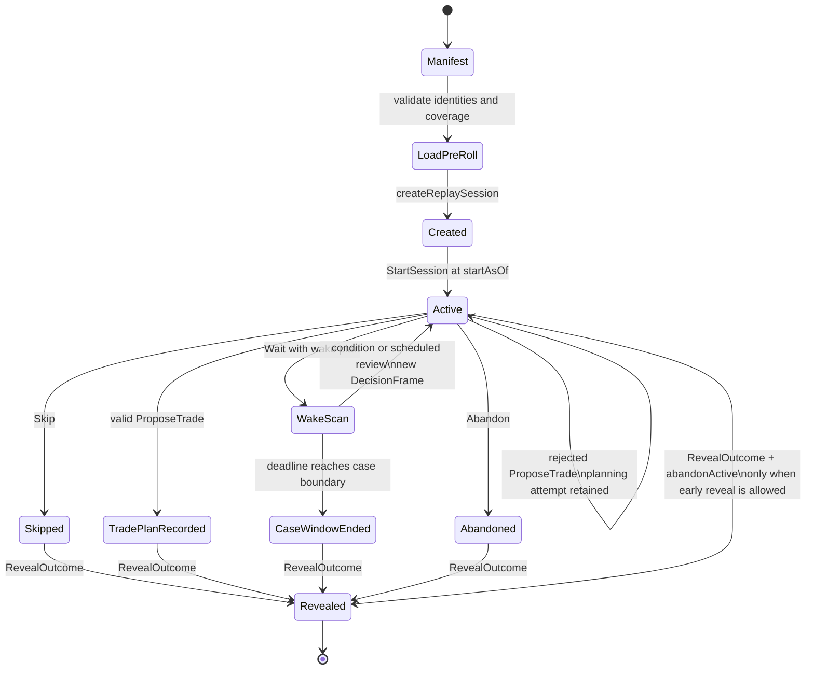

# Replay Phase 1

## Status and scope

Replay Phase 1 is a framework-independent, headless decision-session engine for reviewing a preselected `ReplayCaseManifest` without exposing later market data to the decision maker. It starts at the case's original detection time, presents immutable causal decision frames, records commands and decisions, advances only through explicit wait plans, and reveals the stored outcome only through a separate command and outcome-store boundary.

The implementation is split between:

- `src/replay.ts`: replay schemas, configuration, manifest validation, historical-data adapters, causal loading, candle revision handling, and data fingerprints.
- `src/replayJsonAdapter.ts`: strict JSON fixture parsing and the file-backed audit adapter.
- `src/replaySession.ts`: session state, decision frames, wake plans, commands, events, trade-plan proposals, serialization, resume verification, and outcome reveal.
- `scripts/audit-replay.mjs`: deterministic command-script execution, serialization/resume checks, and explicit outcome reveal for development audits.

> **Research warning:** All default thresholds, pre-roll windows, case durations, wait durations, and strategy parameters are experimental and unoptimized. They are deterministic research defaults, not evidence of profitability or production readiness.

## Design invariants

Phase 1 is built around the following invariants:

1. A session consumes one already-selected and identity-verified `ReplayCaseManifest`; it does not select a random case.
2. The first decision time is exactly `manifest.startAsOf`, which must equal `manifest.detectedAt`.
3. Only completed candles and observations whose `knownAt` is at or before the frame cutoff may enter a decision frame.
4. A decision frame is immutable and contains a `DecisionSnapshot` plus only the candles, events, and analysis state visible at that cutoff.
5. Waiting is a precommitted instruction to advance to a scheduled review, matching wake condition, deadline, or case boundary. It is not unrestricted future browsing.
6. Every accepted command appends a deterministic event. Reusing a command ID is idempotent only when the full command payload is identical.
7. Trade planning ends at a validated, sized, recorded plan. Fill simulation and trade P/L are outside Phase 1.
8. Future outcomes are held behind a separate `ReplayOutcomeStore` and are not included in serialized sessions or decision frames.

## Schema and engine identities

Persist schema IDs and pinned hashes with artifacts. Do not infer compatibility from TypeScript shape alone.

| Artifact | Current ID |
| --- | --- |
| Replay engine | `replay-engine.1` |
| Replay case manifest | `replay-case-manifest.1` |
| Radar episode | `radar-episode.1` |
| Replay session config | `replay-session-config.1` |
| Replay data bundle | `replay-data-bundle.1` |
| Replay session | `replay-session.1` |
| Replay command | `replay-command.1` |
| Replay event | `replay-event.1` |
| Replay decision frame | `replay-decision-frame.1` |
| Replay wake plan | `replay-wake-plan.1` |
| Replay wake condition | `replay-wake-condition.1` |
| Replay wake result | `replay-wake-result.1` |
| Replay analysis state | `replay-analysis-state.1` |
| Replay known event | `replay-known-event.1` |
| Replay outcome envelope | `replay-outcome-envelope.1` |
| Strategy profile | `strategy-profile.1` |
| Decision snapshot | `decision-snapshot.1` |
| Decision record | `decision-record.1` |
| Trade plan | `trade-plan.1` |
| Sizing result | `sizing-result.1` |
| Impulse Fade lifecycle | `impulse_fade_v1.lifecycle.1` |

In addition to schema IDs, the manifest, strategy profile, replay config, radar episode, venue rules, and loaded market-data prefix carry deterministic identities or hashes. `loadReplayCase` fails closed when these references do not match.

### Canonical identity and hashing

Replay artifacts use canonical serialization before identity or integrity checks. `replaySessionConfigHash`, candle/analysis/event ID helpers, wake-plan helpers, frame/event IDs, and session integrity checks make equivalent structured inputs deterministic. Market-data identities use `replaySha256` and `replayDataFingerprintAt`; the latter hashes only records eligible at the requested causal cutoff. Other object IDs use the repository's canonical hash utility. Consumers should compare the complete prefixed hash string and must not mix these hash families as if they were interchangeable.

## End-to-end state flow



`Failed` is part of the session-state schema, but current validation and loading failures generally throw rather than producing a command-driven transition to that state.

## Manifest consumption

`loadReplayCase` accepts a `ReplayCaseManifest`, `StrategyProfile`, `RadarSelectionProfile`, finalized `ReplaySessionConfig`, `ReplayHistoricalDataAdapter`, and optional venue rules. It validates the manifest before loading a session:

- schema and deterministic manifest identity;
- `futureOutcomeRef === null`;
- `startAsOf === detectedAt`;
- matching radar selection profile, strategy profile, replay config, lifecycle version, and execution timeframe;
- matching execution venue and venue-rule references when rules are supplied;
- an exact `RadarEpisode` sidecar whose identity and causal timestamps agree with the manifest;
- sufficient historical analysis coverage at the start time.

The loader produces a `ReplayLoadedCase` containing the validated inputs and a public `ReplayDataBundle` cut off at `manifest.startAsOf`. Later history is registered in a module-private engine store keyed by that loaded case; it is not a property of the returned object and is not exported through the package. `createReplaySession` captures the causal-prefix identities in `ReplaySessionIdentity`; `StartSession` creates the initial frame exactly at `manifest.startAsOf`.

The `InMemoryReplayHistoricalDataAdapter` supplied by `src/replay.ts` is suitable for tests and integrations that already hold historical records. `JsonReplayHistoricalDataAdapter` in `src/replayJsonAdapter.ts` validates the same records from a strict JSON fixture for CLI audits. `ReplayHistoricalDataAdapter` remains the extension point for databases, REST services, or remote archives; production adapters are outside Phase 1.

## Analysis pre-roll and display pre-roll

Analysis and display history are intentionally separate.

### Analysis pre-roll

Analysis pre-roll is the history needed to calculate a causally correct state at the first visible decision. It may be much longer than the candles shown to the user. For every required timeframe, the loader uses the greater of the manifest's declared requirement and the role-based default:

- candidate timeframe: 180 days;
- structure and context timeframes: 90 days;
- other timeframes: 250 bars.

Insufficient analysis coverage is fatal because a valid initial `DecisionSnapshot` cannot be established without it. The adapter must also supply at least one `ReplayAnalysisStateObservation` known at or before `startAsOf`.

### Display pre-roll

Display pre-roll controls how much prior chart history appears in a `ReplayDecisionFrame`. The default is the greater of 200 bars or one day for each visible timeframe. Insufficient display coverage creates a data-quality note rather than failing the case, provided analysis coverage remains sufficient.

The difference is important: reducing visible candles must not change lifecycle, indicator, structure, or strategy calculations. Analysis state comes from the causal analysis history; display candles are only the visible chart window.

> The 180-day, 90-day, 250-bar, 200-bar, and one-day values are experimental and unoptimized defaults. Treat them as pinned research configuration, not optimal settings.

## Replay clock and completed candles

Replay time is an explicit logical cutoff, not wall-clock time. A frame records both `requestedAsOf` and `effectiveAsOf`; normal session advancement uses the earliest valid wake point and materializes the next frame at that effective cutoff.

The default config requires `completedCandlesOnly: true`. A candle is eligible only when:

```text
candle.closeTime <= effectiveAsOf
and
candle.knownAt <= effectiveAsOf
```

If multiple revisions exist for one logical candle, the visible frame uses the latest revision known by the cutoff. Conflicting observations at the same knowledge point fail closed. When revision history is unavailable, the loader records `IMMUTABLE_CANDLE_AT_CLOSE_ASSUMED`; this is an assumption, not proof that the source never revised the candle.

## `eventTime` and `knownAt`

`eventTime` describes when a market event economically occurred. `knownAt` describes the earliest time the replay participant could have observed the finalized record. They are not interchangeable.

- `knownAt` must never precede `eventTime`.
- Candle `knownAt` must never precede candle close.
- Analysis state and known events enter a frame only when `knownAt <= effectiveAsOf`.
- Event-driven wake conditions trigger at the event's `knownAt`, not retroactively at `eventTime`.
- Trade-plan references are rejected when their `knownAt` is later than the current `DecisionSnapshot.effectiveAsOf`.

Example: a one-hour structure break may have an `eventTime` at 12:00 but only become confirmed and available at the 13:00 candle close. A 12:30 frame must not contain or wake on it; the earliest valid knowledge time is 13:00.

## Decision frames

`ReplayDecisionFrame` is the complete public input for one decision. It includes:

- manifest, radar episode, session, and frame identity;
- requested and effective cutoff times;
- the evaluation timeframe;
- compact `ReplayRadarContext` with trigger, path, gate, and selection evidence;
- the framework-independent `DecisionSnapshot` used by strategy and trade planning;
- visible candles and their coverage by timeframe;
- latest visible candle close and a causal market-data fingerprint;
- lifecycle summary, pending decision status, and prior decision summaries;
- the wake result that produced the frame, when applicable;
- data-quality notes and logical creation time.

Frames are immutable clones with deterministic IDs. Consumers should render or evaluate a frame as a value object. The public `ReplayLoadedCase.dataBundle` contains the start-time causal prefix for inspection and audit, while later frames remain the only participant-facing path to subsequently revealed market data.

## Commands, events, and idempotency

All interaction goes through `applyReplayCommand`. Every command carries:

- `schemaVersion: "replay-command.1"`;
- a caller-generated `id` used as the idempotency key;
- `sessionId`;
- `expectedRevision` for optimistic concurrency;
- `currentFrameId`, or `null` before start;
- `submittedLogicalTime`;
- a typed command payload.

Supported commands are:

| Command | Effect |
| --- | --- |
| `StartSession` | Creates the first frame at `manifest.startAsOf` and enters `Active`. |
| `Wait` | Records a wait decision and advances according to a validated wake plan. |
| `Skip` | Records a skip decision and enters `Skipped`. The first reason is primary; additional reasons are retained as tags. |
| `ProposeTrade` | Builds and validates a plan against the current frame, strategy profile, and venue rules. |
| `Abandon` | Ends the active decision session without a trade plan. |
| `RevealOutcome` | Requests the separately stored future outcome after a terminal decision, or performs an explicitly allowed early reveal. |

Each accepted command appends a `ReplayEvent` containing the full command, resulting state, optional frame, decision record, planning attempt, wake plan/result, terminal reason, and reveal metadata. Session revision advances with the event log.

Command idempotency is strict:

- same command ID and canonically identical command: return the existing result without appending another event;
- same command ID with a different payload: reject;
- stale `expectedRevision`, wrong `currentFrameId`, wrong session ID, or invalid logical time: reject.

This makes retries safe while preventing a caller from silently changing an already-recorded decision.

## Wait plans and wakeups

A `Wait` command must include a `ReplayWakePlan` bound to the current frame. A plan can contain a scheduled review, one or more conditions, and a hard `deadlineAsOf`.

Scheduled review modes are:

- `nextCompletedCandle` for a named timeframe;
- `elapsedDuration` for a fixed number of seconds, aligned to the evaluation timeframe's completed-candle clock.

Supported condition families are:

- next lifecycle transition;
- entry into a named lifecycle state;
- confirmed structure event;
- confirmed AVWAP event;
- confirmed relative-strength event;
- crossing a frozen, already-known price level;
- entering a frozen, already-known price zone;
- radar or lifecycle terminal state;
- `AnyOf` composition.

Condition references must already be known in the submitted frame. Their frozen values are validated so a condition cannot be rewritten after submission. Conditions that are already true are rejected; a wait must describe a future review condition.

Advancement scans causal knowledge points and stops at the earliest of:

1. a matching condition;
2. the scheduled review;
3. the plan deadline;
4. the case horizon or available-data boundary.

The resulting `ReplayWakeResult` records the reason, trigger IDs, every evaluated point, encountered lifecycle transitions, and the first triggering cutoff. Simultaneous conditions remain available in the audit trace even though only one next frame is created.

The default maximum case duration is 72 hours, maximum single wait is 24 hours, and default wait deadline is 12 hours. These durations are **experimental and unoptimized**.

## Pause, serialization, and resume

Phase 1 has no separate `Paused` session state. Pausing means stopping command submission after serializing the current session with `serializeReplaySession`. Resuming means loading the same case inputs, then calling `resumeReplaySession` with the serialized session.

Resume verification checks:

- serialized integrity hash;
- manifest, strategy, config, venue, and causal market-data identities;
- absence of forbidden outcome/future fields;
- deterministic reconstruction from the event log;
- reproduction of the current decision-frame identity at the saved cutoff.

`deserializeReplaySession` validates the serialized shape and integrity, while `reconstructReplaySession` rebuilds state from events. Persist both the serialized session and the exact manifest/config/profile artifacts required to reload the case.

## Future-data isolation and reveal

The historical loader may load candles, analysis states, and events through the configured case horizon so that the headless engine can locate a precommitted wake condition. That full history is registered in a module-private `WeakMap` and is never attached to the exported `ReplayLoadedCase`. The returned data bundle is physically filtered to the causal radar boundary.

The public isolation boundary is the `ReplayDecisionFrame`:

- candles are cut off by both close time and `knownAt`;
- analysis state is selected only from observations known by the frame;
- known events are evaluated only when their `knownAt` is reached;
- the session identity stores the causal-prefix fingerprint rather than exposing future records;
- serialization rejects forbidden future/outcome keys.

This is causal isolation, not a cryptographic sandbox. Code that independently owns the original historical adapter or source fixture can still inspect it, but the replay package does not expose later data through the loaded case, session, frames, or public fingerprint helper. Integrations should give a decision policy only frames and command results.

Outcome reveal uses a separate `ReplayOutcomeStore`. Normal reveal is allowed after `Skipped`, `TradePlanRecorded`, `CaseWindowEnded`, or `Abandoned`. Revealing from `Active` requires both `allowEarlyReveal: true` and `abandonActive: true`, and the envelope records `revealedBeforeDecisionCompletion: true`.

`ReplayCaseOutcome` can contain future candles, lifecycle chronology, radar terminal context, and observational maximum favorable/adverse price excursion from detection. Those excursions describe the case path; they are not simulated trade outcomes.

## Trade-plan boundary

`ProposeTrade` delegates to the existing framework-independent trade-planning layer. The session injects the current `DecisionSnapshot`, pinned strategy profile, loaded venue rules, and logical creation time. The proposal supplies the discretionary plan fields and sizing inputs.

An accepted replay trade plan must:

- be `finalized`, not a draft;
- use the current sizing schema/version;
- contain no hard validation errors;
- comply with the pinned strategy unless the replay config explicitly permits out-of-strategy plans;
- comply with venue rules and the manifest's execution venue;
- use only references known by the current frame cutoff.

A rejected proposal is retained as a `ReplayPlanningAttempt`; the session remains `Active` so the participant can correct or abandon it. An accepted proposal creates a `DecisionRecord` and transitions to `TradePlanRecorded`.

Phase 1 stops there. It does not simulate order placement, fills, partial fills, stop or take-profit execution, slippage, fees, funding, liquidation, realized P/L, or position management.

## Headless audit CLI

The deterministic audit CLI consumes one `replay-audit-fixture.1` JSON file containing the pinned manifest, profiles, session config, historical data, optional venue rules and outcome envelope, plus an ordered command script. It uses the public engine APIs rather than duplicating replay logic.

Generate the two bundled audit cases, then execute either one:

```sh
pnpm generate:replay-examples
pnpm audit:replay fixtures/generated/replay-drop-rebound.json \
  --out fixtures/generated/replay-drop-rebound.session.json
pnpm audit:replay fixtures/generated/replay-continuation.json \
  --out fixtures/generated/replay-continuation.session.json
```

The CLI prints the replay clock, frame identity, radar path context, lifecycle state, submitted decision, wait condition and wake result, plan compliance when applicable, terminal state, and a future-data exposure check after every command. It serializes and resumes after each accepted command to exercise deterministic persistence. Outcome data is requested only by an explicit `RevealOutcome` command and is written separately from the public session object.

The generated source fixtures and serialized public sessions are committed as reproducible examples. Regenerating the source fixtures is deterministic; rerunning the audit verifies that pre-reveal session serialization remains sealed.

The equivalent module-level sequence is:

```ts
const config = createReplaySessionConfig(configDefinition, strategyProfile);
const loaded = await loadReplayCase({
  manifest,
  strategyProfile,
  radarSelectionProfile,
  sessionConfig: config,
  historicalDataAdapter: adapter,
  venueRules,
});

let session = createReplaySession(loaded);
({ session } = await applyReplayCommand(loaded, session, startCommand));

await persist(serializeReplaySession(session));
```

Production persistence should add atomic file replacement and durable command journaling. The audit CLI intentionally remains a deterministic, non-interactive development tool rather than a multi-process session service.

## Default research configuration

`createDefaultReplaySessionConfig` currently produces:

| Setting | Default |
| --- | --- |
| Config identity | `impulse_fade_v1.replay.research.default`, version `1` |
| Evaluation timeframe | Strategy execution timeframe |
| Visible timeframes | Execution, structure, and context timeframes |
| Display pre-roll | `max(200 bars, 1 day)` per timeframe |
| Maximum case duration | 72 hours |
| Maximum single wait | 24 hours |
| Default wait deadline | 12 hours |
| Candle policy | Completed candles only |
| Identity presentation | Full |
| Early reveal | Disabled |
| Out-of-strategy plans | Disabled |
| Discretionary overrides | Enabled |
| End on radar terminal | Disabled |
| End on lifecycle terminal | Disabled |

All values in this table, plus thresholds inherited from the radar, lifecycle, strategy, and trade-planning profiles, are **experimental and unoptimized**. Reproducibility requires pinning them; pinning does not validate them.

## Known limitations

- Only the current Impulse Fade lifecycle/profile family is integrated and identity-checked.
- `InMemoryReplayHistoricalDataAdapter`, `JsonReplayHistoricalDataAdapter`, and `InMemoryReplayOutcomeStore` are development implementations; there is no production database or REST adapter.
- The replay engine consumes precomputed `ReplayAnalysisStateObservation` and `ReplayKnownEvent` histories; it does not recalculate indicators or lifecycle state from candles. When no newer analysis observation exists at a frame cutoff, it emits `CARRIED_FORWARD_ANALYSIS_STATE` instead of silently presenting the observation as freshly calculated.
- Optional point-in-time venue and universe evidence methods exist on the adapter boundary. Supplied venue evidence is provenance-checked and enforced for trade-plan acceptance, but Phase 1 does not provide historical exchange ingestion or a production evidence store.
- Full future data exists only in the module-private engine registry to support deterministic wait advancement. The original caller may still own the source adapter, so process-level secrecy remains an integration responsibility.
- Sources without candle revision history rely on the explicit immutable-at-close assumption.
- Session persistence is canonical JSON supplied by the caller; there is no database, locking service, or multi-process coordinator.
- `identityPresentationMode` is configuration metadata. Phase 1 does not implement UI masking or blinded presentation.
- `Failed` exists as a schema state, while most current failures are fail-closed exceptions rather than persisted failure events.
- The bundled CLI executes complete JSON audit fixtures but is not an interactive UI or production session service.

## Non-goals for Phase 1

Phase 1 intentionally does not include:

- replay UI, chart controls, random-case selection, or UI-only masking;
- order-book or tick-level replay;
- intra-candle event ordering;
- order simulation, fills, partial fills, stop-loss or take-profit execution;
- trade MAE/MFE, realized or unrealized P/L, slippage, fees, funding, or liquidation;
- scale-in, scale-out, trailing-stop, or broader position management;
- post-trade scoring, AI critique, or automated strategy grading;
- database persistence, live radar persistence, or distributed sessions;
- point-in-time Phemex ingestion or any exchange-specific historical pipeline;
- parameter optimization, threshold fitting, profitability claims, or production calibration;
- new strategies, indicators, lifecycle models, or automated case selection.

Those concerns should be added only after the Phase 1 causal boundary, event log, resume behavior, and outcome isolation have dedicated acceptance coverage.
