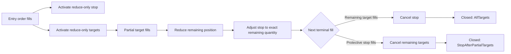
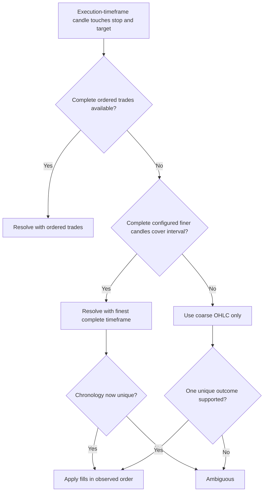
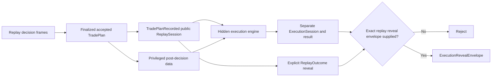

# Replay Phase 2A Execution

## Status and scope

Replay Phase 2A is a framework-independent, deterministic research execution
engine for one finalized short `TradePlan` on a linear quote-margined perpetual.
It begins only after Replay Phase 1 has recorded an accepted plan. It models
entry activation and fills, static reduce-only protection, partial targets,
fees, funding, margin bookkeeping, execution ambiguity, and outcome metrics.

The implementation is split between:

- `src/execution.ts`: execution schemas, versioned profiles and venue rules,
  historical-data contracts, immutable observations, and case loading.
- `src/executionJsonAdapter.ts`: strict JSON fixture validation and the in-memory
  adapter used by the audit workflow.
- `src/executionSession.ts`: the state machine, chronological fill processing,
  accounting, event-log reconstruction, serialization, and resume checks.
- `src/executionReveal.ts`: the explicit bridge from a revealed replay outcome
  to an execution reveal envelope.
- `scripts/audit-execution.mjs`: a deterministic, privileged audit runner using
  the built `dist/core.js` entry point.

This is a research model. It does not place orders, reproduce an exchange
matching engine, or claim that candle-derived fills were historically
executable.

## Replay engine versus execution engine

Replay Phase 1 answers: "What was knowable, what decision was made, and when?"
Replay Phase 2A answers: "Given that frozen decision and these versioned
execution assumptions, what execution path can the supplied post-decision data
support?"

The boundary is intentional:

| Replay decision engine | Execution engine |
| --- | --- |
| Presents causal `ReplayDecisionFrame` values | Consumes one accepted finalized `TradePlan` |
| Records Wait, Skip, and ProposeTrade decisions | Activates and evaluates entry/protective orders |
| Prevents future observations entering a decision | Has privileged access to post-decision execution data |
| Stores no fills, P&L, MAE, or MFE | Produces a separate `ExecutionSession` and `ExecutionResult` |
| Reveals a case outcome explicitly | Can join its result to that reveal only through `ExecutionRevealEnvelope` |

Later lifecycle states, RS events, AVWAP events, support/resistance changes,
setup transitions, and `CARRIED_FORWARD_ANALYSIS_STATE` observations are not
execution inputs. They cannot move a stop, change a target, suppress a fill, or
otherwise rewrite the frozen plan. They may be reviewed after reveal, but they
do not control execution.

## Immutable inputs and identity

`loadExecutionCase()` accepts the exact replay session and current frame, the
accepted finalized short `TradePlan`, its `StrategyProfile`, an
`ExecutionProfile`, point-in-time `VenueExecutionRules`, a point-in-time
`VenueFeeSchedule`, and a `ReplayExecutionDataAdapter`.

Loading fails closed unless all of the following remain consistent:

- replay session, current frame, decision snapshot, and accepted plan IDs;
- canonical `TradePlan` identity and `trade-plan.1` schema;
- finalized status, short side, and absence of hard compliance errors;
- strategy profile ID, version, hash, lifecycle version, and lifecycle hash;
- execution profile, venue-rule, and fee-schedule canonical hashes;
- fee and venue-rule effective windows through the execution horizon;
- the frozen planning-rule subset: venue, symbol, tick, quantity step, maximum
  leverage, and fee reference;
- an executable, positive, step-aligned quantity within venue limits;
- a supported executable entry type and stop trigger source;
- positive initial margin and a planned stop below the simple bankruptcy bound.

The resulting session identity pins all of those references plus the sizing,
replay, and execution engine versions, causal market-data fingerprint, funding
prefix fingerprint, decision time, activation time, and horizon. Content-based
IDs, canonical serialization, immutable clones, and an integrity hash prevent a
resumed session from silently changing its execution assumptions.

`ExecutionDataBundle.internalBundleFingerprint` covers the loaded execution
history. The session-facing `marketDataBundleFingerprint` deliberately uses
the causal prefix at decision time, while the final result separately records
the observations actually used through `usedMarketDataFingerprint` and
`pathResolutionRecords`. Treat `ExecutionLoadedCase` as privileged execution
state; it is not participant-facing replay data.

## Version identifiers

Persist schema IDs and versioned references with every audit artifact. Package
version compatibility is not a substitute for execution semantic compatibility.

| Artifact | Current identifier |
| --- | --- |
| Execution engine | `execution-engine.1` |
| Execution profile | `execution-profile.1` |
| Execution session | `execution-session.1` |
| Execution order | `execution-order.1` |
| Execution fill | `execution-fill.1` |
| Execution event | `execution-event.1` |
| Execution result | `execution-result.1` |
| Execution data bundle | `execution-data-bundle.1` |
| Execution JSON data | `execution-json-data.1` |
| Execution candle | `execution-candle.1` |
| Execution trade | `execution-trade.1` |
| Execution quote | `execution-quote.1` |
| Path-resolution record | `execution-path-resolution.1` |
| Venue execution rules | `venue-execution-rules.1` |
| Venue fee schedule | `venue-fee-schedule.1` |
| Funding observation | `funding-observation.1` |
| Position ledger | `position-ledger.1` |
| Execution reveal envelope | `execution-reveal-envelope.1` |
| Audit CLI input | `execution-audit-input.1` |

The experimental default profile is
`linear-short.replay.research.default`, version `1`. Its defaults include fixed
adverse slippage, `TouchFills` resting limits and targets, last-price stops,
funding-incomplete behavior when funding is absent, a 72-hour horizon, no
forced close, and `StrictAmbiguity`. These are pinned research assumptions, not
exchange-calibrated defaults.

An execution-semantic change requires a new execution-engine or profile version.
A fee or venue-rule change requires a new version/hash and the appropriate
point-in-time effective window.

## Session lifecycle

The supported states are:

| State | Meaning |
| --- | --- |
| `Created` | Validated inputs are bound; no entry is active yet. |
| `PendingEntry` | The entry is active and waiting for a qualifying observation. |
| `Open` | The full filled quantity remains open. |
| `PartiallyClosed` | At least one target filled and quantity remains. |
| `Closed` | Remaining quantity is zero. |
| `EntryExpired` | No entry fill occurred before plan expiry or the execution horizon. |
| `OpenAtHorizon` | A position remains open and is marked, not synthetically exited. |
| `Ambiguous` | Available data cannot prove one chronological execution path. |
| `Failed` | Mandatory data, input, or invariant requirements were not met. |

Terminal states are sticky. Advancing a terminal session returns an immutable
clone and cannot append a second close, fill, fee, or funding event.

## Activation and entry behavior

The activation clock is:

```text
decision frame effectiveAsOf
  + ExecutionProfile.orderActivationPolicy.delaySeconds
  = orderActivationTime
```

No entry can fill before `orderActivationTime`. With complete ordered trades,
the first eligible observation has `eventTime >= orderActivationTime` and
`knownAt <= current cutoff`. With candles, the engine uses the first eligible
candle whose open is at or after activation. A candle that spans activation but
opened before it is not used to fill the order.

### Market at next available price

A short market entry fills the complete planned quantity at the next eligible
path open/trade price. Fixed adverse entry slippage lowers the short's fill
price, the result is normalized down to the venue tick, and a taker fee is
charged on actual fill price times quantity. Candle execution carries an
approximation note.

### Sell limit

A sell limit is normalized up to the venue tick.

- If the first eligible path opens at or above the limit, it fills at that open
  and is classified `assumedTaker`.
- Otherwise, the configured resting policy controls the fill:
  `TouchFills`, `PenetrationByTicks`, or `ExactDataRequired`.
- A resting fill occurs at the limit, has no market slippage, and is classified
  `assumedMaker` when inferred from candle data.
- It never fills below its limit.

If an approximate candle touches both the entry and an exit barrier, chronology
is not invented; the session becomes `Ambiguous`.

### Sell stop-market

A sell stop-market entry is normalized down to the venue tick. It triggers when
the selected path opens at or below the trigger, or when its low crosses the
trigger. A gap uses the open; an intrapath cross uses the trigger. The fill is a
taker fill with adverse market-entry slippage. Protective orders are created
only after the entry fill.

`manualReference` plans remain planning artifacts and are rejected as execution
inputs.

## Protection, reduce-only behavior, and OCO

Immediately after a full entry fill, the engine activates:

- one reduce-only protective buy stop for the full remaining quantity; and
- one or more reduce-only buy-limit targets allocated from the actual filled
  quantity.

Target prices are normalized down to the price tick and the stop is normalized
up. Non-final target allocations are floored to the quantity step. The final
target receives the deterministic step-rounded residual, so total target
quantity cannot exceed the position.

When a target fills, the ledger realizes short P&L on that quantity and the stop
quantity is reduced to the exact remaining position. When the stop fills, every
remaining target is cancelled. When all target quantity fills, the stop is
cancelled. Every activation, fill, adjustment, cancellation, partial close, and
final close is an immutable execution event. No protective order can reverse
the position.



## Stop and target semantics

For a last-price protective stop on a short:

- if a path opens above the stop, the opening price is the trigger/fill
  reference;
- otherwise, `high >= stop` triggers at the stop price;
- adverse stop slippage raises the buy fill price and is normalized up;
- the taker fee uses the actual slipped fill price and remaining quantity.

For mark- or index-triggered stops, the selected series must contain an eligible
observation in the path interval. The engine never silently substitutes last
price. It either uses a profile-authorized last-price fallback and records that
assumption, or fails the execution.

A buy-limit target fills only when its configured policy is satisfied. The
current model fills a resting target at its limit without adverse market
slippage and charges the maker rate under an `assumedMaker` classification.
Price improvement and queue position are not simulated.

## Path resolution and causality

The intended hierarchy is ordered trades, sufficient ordered quotes,
progressively finer candles, the execution-timeframe candle, then ambiguity.
The implemented hierarchy is currently:

1. Complete ordered trades, when the adapter declares the trade series
   `complete`.
2. The finest configured candle timeframe that completely and contiguously
   covers each execution-timeframe candle and is known by the processing cutoff.
3. The execution-timeframe candle.
4. `Ambiguous` when an approximate interval still cannot establish order.

Partial trade data is retained for provenance but is not mixed into path
resolution. Finer candle data is accepted only when it covers the entire coarse
interval, has no gaps, and was known no later than both the current cutoff and
the coarse candle. This prevents selective use of a favorable fragment.

Each processed interval records requested and selected resolution, data source,
exact/approximate status, source IDs, and a deterministic fingerprint.
`eventTime` identifies when the market observation occurred;
`processingAsOf` is derived from `knownAt` and identifies when the engine could
causally process it. Future observations are filtered by `knownAt` at every
incremental cutoff.



The engine does not synthesize `Open -> High -> Low -> Close` or another hidden
intrabar path. Candle highs and lows establish barrier contact, not chronology.

## Strict ambiguity

`StrictAmbiguity` is the implemented behavior and the default. Examples include:

- entry and an exit barrier touched in the same unresolved candle;
- stop and one or more targets touched in the same unresolved candle;
- bankruptcy bound crossed without a verified liquidation model; and
- funding coincident with fills when venue ordering is declared `ambiguous`.

The first unresolved interval terminates the session as `Ambiguous`. The result
preserves the affected orders, source observations, straightforward `stop-first`
and `target-first` branches, and lower/upper estimated net P&L bounds when they
can be calculated. It does not choose a winner, loser, or preferred branch.

The `WorstCaseBranch` value exists in the profile type for future extension, but
Phase 2A does not execute a worst-case branch. Current engine behavior remains
fail-closed even if that value is supplied.

## Slippage, fees, and funding

### Slippage

`FixedBpsSlippage`, version `1`, has independent rates for market entry, stop
exit, and forced market exit. Slippage is always adverse to the short:

```text
short market sell: raw fill = reference * (1 - bps / 10,000)
short market buy:  raw fill = reference * (1 + bps / 10,000)
```

The final fill is rounded adversely to the venue price tick. Each fill preserves
the reference, model/version, basis points, signed adjustment, and actual price.
Resting targets receive no arbitrary market slippage.

### Fees

Every fill records its liquidity role, fee rate, amount, currency, and exact
versioned fee-schedule reference. Fees are recalculated from actual fill price
and quantity:

```text
fee = actualFillPrice * fillQuantity * applicableRate
```

`maker` and `assumedMaker` use the maker rate; taker variants use the taker
rate. Research schedules are marked `RESEARCH_FEE_ASSUMPTION`. Effective windows
must cover the full execution horizon so current fees cannot silently be applied
to an older case.

### Funding

The fixed convention is `positive rate = longs pay shorts`. Therefore:

```text
fundingAmount = remainingQuantity * suppliedMarkPrice * fundingRate
```

A positive amount is received by the short; a negative amount is paid. Funding
uses the remaining quantity, so a target before a later funding timestamp
reduces the charge or credit. Same-time position/funding ordering follows the
venue rule (`positionBeforeFunding` or `fundingBeforePosition`); an unknown
ordering fails closed as ambiguity.

Funding observations require an explicit reference price. Under
`markIncomplete`, unavailable funding or a missing reference leaves price-path
execution usable but sets `actualNetPnlCompleteness` to `fundingIncomplete` and
keeps `actualNetPnl` null. `netPnlExcludingUnknownFunding` remains available.
Under `requireComplete`, a missing funding reference fails execution.

## Linear-short P&L

For each buy exit from a linear short:

```text
exitGrossPnl = exitQuantity * (averageEntryPrice - exitPrice)
```

The ledger accumulates exit gross P&L and fees. For a fully closed position:

```text
realizedNetPnl = realizedGrossPnl - totalFees + netFunding
```

For an open position at horizon:

```text
unrealizedGrossPnl = remainingQuantity * (averageEntryPrice - horizonMark)
markedNet = realizedNetPnl + unrealizedGrossPnl
```

Unknown future fees and funding are not invented. `actualNetPnl` is returned
only when the outcome is neither ambiguous nor funding-incomplete.

The result preserves both requested-budget and projected-stop denominators:

```text
budgetR      = actualNetPnl / sizingResult.riskBudget
plannedRiskR = actualNetPnl / sizingResult.projectedLossAtStop
grossR       = realizedGrossPnl / sizingResult.projectedLossAtStop
netR         = actualNetPnl / sizingResult.projectedLossAtStop
```

`budgetR`, `plannedRiskR`, and `netR` remain null when definitive net P&L is not
available. This avoids presenting an incomplete or ambiguous outcome as one
precise R multiple.

## Leverage, margin, bankruptcy, and liquidation

Leverage comes from the frozen `TradePlan`; it does not resize the already
risk-sized quantity. At entry:

```text
initialNotional = actualEntryPrice * filledQuantity
initialMargin   = initialNotional / selectedLeverage
```

Phase 2A records selected leverage, initial margin, margin allocation, maximum
margin used, maximum adverse unrealized loss, and an approximate bankruptcy
bound for an isolated short:

```text
bankruptcyBoundApprox = entryPrice + initialMargin / filledQuantity
```

This bound ignores maintenance margin, fees, venue tiers, and liquidation-engine
behavior. It is not a liquidation price. A plan whose stop is already at or
beyond the planned bound is rejected. If the observed path crosses the bound,
the engine records `BankruptcyBoundCrossed` and terminates as `Ambiguous` with
`BANKRUPTCY_BOUND_CROSSED_WITHOUT_LIQUIDATION_MODEL`; it does not claim that the
later protective stop definitely filled.

Venue-rule types can reference maintenance-margin and liquidation model IDs,
but no exact liquidation calculation is implemented in Phase 2A.
`liquidationEvaluation` is therefore `Unavailable` or
`VerifiedModelNotImplemented`, and the data-quality record retains
`EXACT_LIQUIDATION_MODEL_UNAVAILABLE` when no model is supplied.

## Execution horizon

The horizon is measured from order activation:

```text
executionHorizonTime = orderActivationTime + maximumExecutionHorizon
entryExpiry = min(TradePlan.entryPlan.expiresAt, executionHorizonTime)
```

An unfilled entry becomes `EntryExpired` only when fresh price coverage supports
that conclusion; missing expiry-window coverage fails execution. By default, an
open position at the horizon becomes `OpenAtHorizon`. The engine uses the last
fresh eligible close as a mark and keeps realized and unrealized P&L separate.

If `forceCloseAtHorizon` is enabled, the position closes at the first eligible
path open at or after the horizon, with adverse market-exit slippage and a taker
fee. The close reason is `ForcedHorizonClose`. The profile hash binds this choice.

## MAE and MFE

Excursions begin only after entry. For a short:

```text
MAE price excursion = max(0, highestPostEntryPrice - entryPrice)
MFE price excursion = max(0, entryPrice - lowestPostEntryPrice)
```

The result records excursion values, prices, observation times, and the finest
selected resolution. Trade paths provide exact observed prices. Candle paths use
valid high/low extrema but cannot identify the exact intrabar time or sequence;
the candle's path timestamp and resolution preserve that limitation.

The current required metrics are raw price excursions. The ledger also tracks
maximum adverse unrealized loss using remaining quantity, but Phase 2A does not
emit a complete position-weighted MAE/MFE series after partial exits.

## Event log, incremental execution, and resume

Every event has a deterministic ID and sequence, `eventTime`,
`processingAsOf`, state before/after, related order/fill/source IDs, accounting
values, explanations, and complete post-event snapshots. The event log is the
reconstruction source for the session.

The headless APIs are:

```ts
import {
  loadExecutionCase,
  createExecutionSession,
  advanceExecutionTo,
  finalizeExecutionAtHorizon,
  simulateExecutionToHorizon,
  serializeExecutionSession,
  deserializeExecutionSession,
  reconstructExecutionSessionFromEvents,
} from "@cryptodouche/gpu-chart-vue/core";
```

`advanceExecutionTo()` recomputes causally through the requested cutoff and
requires the existing event log to be an exact prefix of the result. It rejects
backward time, changed session identity, or changed history. Repeating an
advance cannot duplicate fills or funding. Serialization validates the session
integrity hash, reconstructs state from events, and checks quantity, fee,
terminal-result, event-ID, and result-ID invariants before writing canonical
JSON.

The test suite covers equality between incremental and one-shot execution,
serialized resume, physical data truncation, idempotent advancement, and event
reconstruction.

## Reveal boundary

Execution is intentionally separate from public replay serialization. A replay
session at `TradePlanRecorded` contains no execution session, fills, result,
P&L, MAE/MFE, or terminal execution identity.

`revealExecutionOutcome()` succeeds only when:

- the replay session is already `Revealed`;
- the supplied `ReplayOutcomeEnvelope` is canonically valid and is the exact
  envelope recorded by that replay session;
- the execution session belongs to that replay session;
- execution is terminal and has a result; and
- the execution result points back to the exact execution session.

It returns a content-addressed `ExecutionRevealEnvelope` containing the case
outcome, execution result, and execution events. The original replay session is
not mutated.



The audit CLI is a privileged development tool and prints hidden execution
progress even without `--reveal`, but suppresses the terminal result summary.
The flag controls creation of the public reveal envelope and display of the
terminal result; it is not access control for the operator running the local
CLI. Do not wire the non-reveal CLI output into a participant-facing replay UI.

## Strict JSON data adapter

`JsonReplayExecutionDataAdapter` consumes `execution-json-data.1` fixtures with
one venue/symbol identity and arrays for candles, trades, quotes, mark prices,
index prices, funding, and venue-rule evidence. It:

- rejects missing or unknown top-level fields;
- rebuilds and verifies content-derived observation IDs;
- rejects instrument mismatches and globally duplicate IDs;
- rejects duplicate candle intervals;
- preserves declared trade and quote completeness;
- distinguishes unavailable funding from an available empty series; and
- sorts returned clones deterministically.

The browser-facing TypeScript module has no Node file-system dependency. The
Node CLI reads JSON and passes the parsed object to the adapter.

## Audit CLI

Build and run a hidden execution audit:

```sh
pnpm audit:execution \
  replay-session.json \
  execution-input.json \
  --out execution-session.json
```

Create an execution reveal envelope after the Replay Phase 1 session has been
explicitly revealed:

```sh
pnpm audit:execution \
  replay-session.json \
  execution-input.json \
  --reveal \
  --out revealed-execution.json
```

The second JSON file uses `execution-audit-input.1` and contains:

- `replaySessionId`, `replayFrameId`, and `tradePlanId`;
- exact strategy, execution, venue-rule, and fee-schedule objects with hashes;
- strict `execution-json-data.1` data; and
- `replayOutcomeEnvelope` when `--reveal` is requested.

The CLI imports from `dist/core.js`, rebuilds every supplied configuration to
verify its hash, requires exactly one accepted plan on the current frame, runs
through observation knowledge-time checkpoints, serializes/deserializes after
each advance, and compares the final incremental session byte-for-byte with a
one-shot simulation. It prints compact hidden state, event, fill count,
quantity, gross P&L, fees, and funding summaries. With `--reveal`, it also
prints the terminal result, R, MAE/MFE, and ambiguity summary.

## Deterministic examples

Regenerate the examples with:

```sh
pnpm generate:execution-examples
```

The generated fixtures under `fixtures/generated/execution/` cover:

| Fixture | Behavior demonstrated |
| --- | --- |
| `clean-stop.json` | Next-open market entry and a later clean stop |
| `multiple-targets.json` | Two targets, stop resizing, and final stop cancellation |
| `target-then-stop.json` | Partial target followed by `StopAfterPartialTargets` |
| `unfilled-entry.json` | Limit expiry without a position |
| `gap-through-stop.json` | Gap reference plus adverse stop slippage |
| `unresolved-ambiguity.json` | Same-candle stop/target ambiguity |
| `lower-timeframe-resolved.json` | Finer complete candles resolve the coarse interval |
| `funding-after-partial.json` | Funding applied to remaining quantity |
| `missing-funding.json` | Price result retained with incomplete net P&L |
| `open-at-horizon.json` | Open position marked without a fabricated exit |

Each generated artifact records the execution session summary, result and event
log, the public replay-session hash, and an assertion that public replay did not
contain execution outcome fields. They are deterministic model examples, not
evidence of historical exchange fills.

## Known limitations

Phase 2A intentionally does not implement:

- long execution paths or non-linear/inverse instruments;
- multiple simultaneous positions, portfolio margin, or cross margin;
- partial entry fills, scale-in, pyramiding, re-entry, or manual scale-out;
- stop movement, trailing stops, dynamic targets, or user-directed management;
- order-book queue position, market impact, stochastic slippage, or spread
  reconstruction;
- live exchange APIs or order placement;
- exact exchange liquidation, maintenance-margin tiers, insurance, or ADL;
- database persistence or a visual execution/replay UI;
- post-decision strategy, lifecycle, indicator, or analysis-state control of
  fills;
- a complete position-weighted MAE/MFE series.

Additional implementation boundaries to account for:

- Quotes, mark prices, and index prices are loaded and identity-checked. Mark and
  index observations can trigger configured stops, but quotes are not yet used
  as an ordered executable path despite being represented by the path schema.
- Only a globally declared complete trade series takes precedence over candles;
  partial trades are not combined with candles.
- `WorstCaseBranch` is a schema value, not an implemented branch-selection
  policy. Ambiguity remains terminal and fail-closed.
- Liquidation model references can be carried by venue rules, but execution of
  a verified liquidation event is not implemented.
- Candle observations support barrier and excursion extrema but cannot prove
  queue fills, exact intrabar times, or intrabar ordering.
- Research fee schedules, venue rules, fill policies, and fixed slippage remain
  assumptions unless their provenance says otherwise.

These limitations are part of the audit interpretation. An `ExecutionResult`
describes what this pinned model can establish from the supplied data, not what
an exchange account necessarily would have filled.
